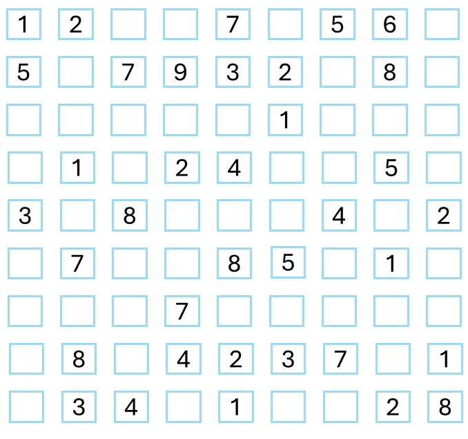
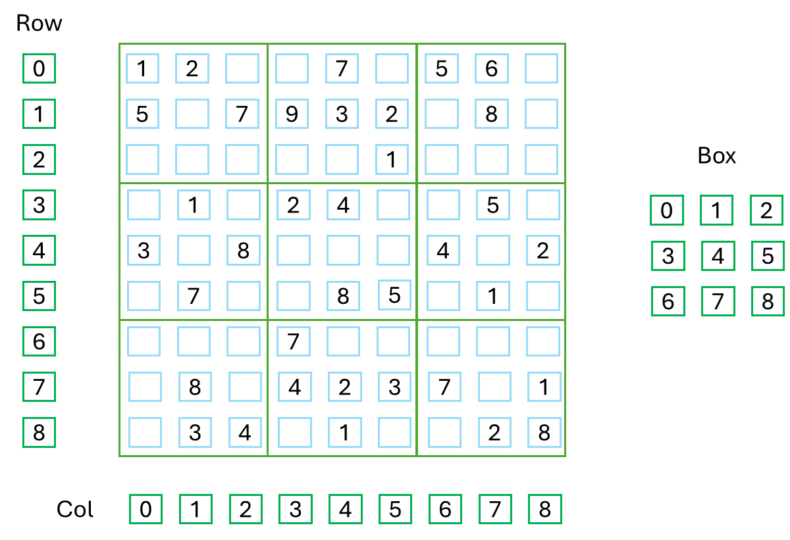

# Problem-Space Reduction

At some point in your Algorithm X journey, you will encounter problems that are too big for backtracking alone. The problem space that must be explored to find all solutions requires an unacceptable amount of time. In these cases, the key is often to use logic to reduce the problem space before starting the backtracking. As has already been demonstrated, backtracking via Algorithm X can solve many problems without any problem-space reduction. We will soon see that logical, problem-space reduction can also solve some problems with no need for any backtracking. In the end, most medium and hard puzzles eventually present test cases that require a combination of both.

If simply solving the puzzle is your goal, a small amount of problem-space reduction before the backtracking will probably get you there. However, if you want to harvest as much education as possible from these puzzles, I suggest you consider doing the following:

1. Solve as many test cases as possible with backtracking alone.

1. Solve as many test cases as possible with problem-space reduction alone.

1. Only after you have exhausted all options for 1 and 2, use a combination of both.

There are many ways to approach problem-space reduction. You will need to choose various data structures and build an algorithm to mimic what you would do if you were trying to solve the puzzle with a pencil on paper. In the rest of this section, I will lay out a structure and a process I have used repeatedly that has worked well for me.

---

# One More Round of Sudoku

Consider __Test Case 1: Very Easy__ from [Sudoku Solver](../04-your-turn/02-9x9-sudoku.md) on [CodinGame](https://www.codingame.com). In the test cases, a `0` represents an unknown cell. The following diagram leaves the unknown cells empty.

{ class="center-image" }

From the problem statement:

>A sudoku is a Latin Square which has the numbers 1-9 in each row, column, and 3x3 square.

In the following diagram, I have assigned numbers to each row, column and box (sub-grid square). Because Python is 0-indexed, I have started numbering at zero.

{ class="center-image" }

It is time to use logic to find more numbers in the Sudoku before starting any backtracking.

 