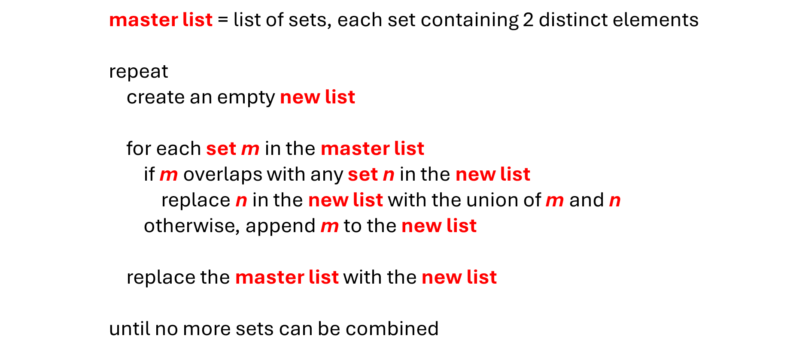

# Reducing Sets of Events

The Scavenger Hunt made it easy to identify the all-or-none sets of events as the children were simply grouped by last name. It is more common to have many sets of events that contain only 2 elements and it is up to you to combine the sets where possible and build a minimum number of completely independent sets. Let’s explore a short algorithm for doing that.

In the realm of sameness, there are two fundamental building blocks. The first is a single standalone item. The second is two items that need to be the same. For instance, `A` must be the same as `B`. Given a list of sets, where each set contains a single element or 2 elements that must be the same, the following pseudocode reduces that list to a minimum number of sets, where no 2 sets have any overlap.

{ class="center-image" }

---

# Test Your Skills

The following exercise gives you a chance to practice reducing a list of sets that might have overlap to a list of sets where no two sets overlap with each other. The number of distinct elements does not change, but any two sets that have overlap must be combined, resulting in a shorter list of all-or-none sets. Each set in the final list contains a group of elements that all must be the same in some way.

**Exercise**

Write a Python function to minimize a list of sets. Below is some starter code and a few test cases to help you verify your solution:

```python
def minimize_all_or_none_sets(all_or_none_sets: list[set[str]]):

    # Reduce the number of sets in the list by
    # combining any sets that overlap.
    
    return all_or_none_sets

TESTS = [
            [{'A', 'B'}, {'C', 'D'}, {'E', 'F'}],  
            [{'A', 'B'}, {'B', 'C'}],  
            [{'A', 'B'}, {'B', 'C'}, {'C', 'D'}, {'E', 'F'}],
            [{'A', 'B'}, {'B', 'C'}, {'C', 'D'}, {'E', 'F'}, {'A'}, {'Z'}],
            [{'A', 'B'}, {'A', 'C'}, {'A', 'D'}, {'A', 'F'}, {'X', 'Y'}, {'Z', 'Y'}, {'E', 'F'}, {'J', 'K'}, {'Z', 'P'}],
            [{'A'}, {'Z'}, {'Q'}, {'A', 'B'}, {'A', 'C'}, {'A', 'D'}, {'A', 'F'}, {'X', 'Y'}, {'Z', 'Y'}, {'E', 'F'}, {'J', 'K'}, {'Z', 'P'}]
        ]

for test in TESTS:
    print(minimize_all_or_none_sets(test))
```

??? success "Expected answers for each test case..."

    ```python
    [{'A', 'B'}, {'C', 'D'}, {'E', 'F'}]

    [{'A', 'B', 'C'}]  

    [{'A', 'B', 'C', 'D'}, {'E', 'F'}]

    [{'A', 'B', 'C', 'D'}, {'E', 'F'}, {'Z'}]

    [{'A', 'B', 'C', 'D', 'E', 'F'}, {'P', 'X', 'Y', 'Z'}, {'J', 'K'}]

    [{'A', 'B', 'C', 'D', 'E', 'F'}, {'P', 'X', 'Y', 'Z'}, {'Q'}, {'J', 'K'}]

    ```

    * The results above show all set elements sorted. Because sets are unordered, your results might not be in the same order. The elements of each set are what matters.

Thoroughly test your algorithm as it will be very helpful in the upcoming exercises!

---

# A Few XP for Your Efforts

Before tackling your next exact cover problem, apply your new skills to the following puzzle and capture a few XP along the way!

__Puzzle:__ [Networking](https://www.codingame.com/training/medium/networking)

__Author:__ [@Gladwell](https://www.codingame.com/profile/4862914f30331ebb394c6539dc1b4bde5659885)

__Published Difficulty:__ Medium

<BR>