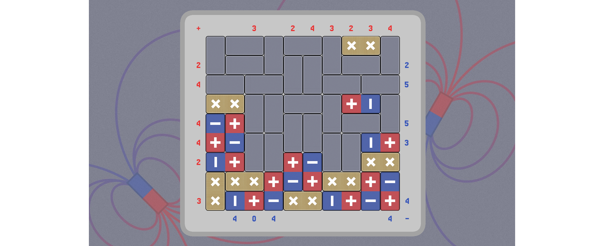

# Magnets

__Puzzle:__ [Magnets - AWAITING APPROVAL](https://www.codingame.com/contribute/community)

__Author:__ [@VizGhar](https://www.codingame.com/profile/c152bee9fe8dc90ac4f6b84505b59ebb9086993)

__Published Difficulty:__ Medium

__Algorithm X Complexity:__ 

---

{ class="center-image" }

---

# Strategy

@VizGhar’s **Magnets** puzzle is a **polarizing** test of logic, where every decision attracts or repels another. You must fill the grid with polarized magnets and neutral wooden blocks. To keep the grid *stable*, no two orthogonal cells can share the same polarity — no two `+` cells or two `–` cells may touch. Each row and column must also satisfy its given counts of positive and negative poles.

A basic **Algorithm X** setup will get you most of the way there, but the toughest test cases require a bit of extra optimization — something you can approach in several ways. As you might expect by now, I chose a round of logical **problem-space reduction** that trimmed the hardest grids down to smaller, solvable cores that Algorithm X could finish effortlessly.

This puzzle is based on [**Magnets**](https://www.chiark.greenend.org.uk/~sgtatham/puzzles/js/magnets.html) from Simon Tatham’s *Portable Puzzle Collection*. Logical deduction feels a bit more elusive here than in many other puzzles, but playing a few rounds by hand is a great way to uncover useful strategies and develop a stronger intuition for the puzzle’s magnetic dynamics.

---

# Solving Logic Puzzles Logically

Many **Magnets** test cases and validators can be solved *purely by logic*, without a single guess. Click [here](../24-odds-and-ends/01-solving-with-logic-only.md) to see my ongoing progress toward solving as many logic puzzles as possible—strictly with logic, no guessing, no backtracking.

 